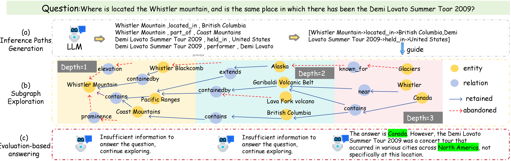
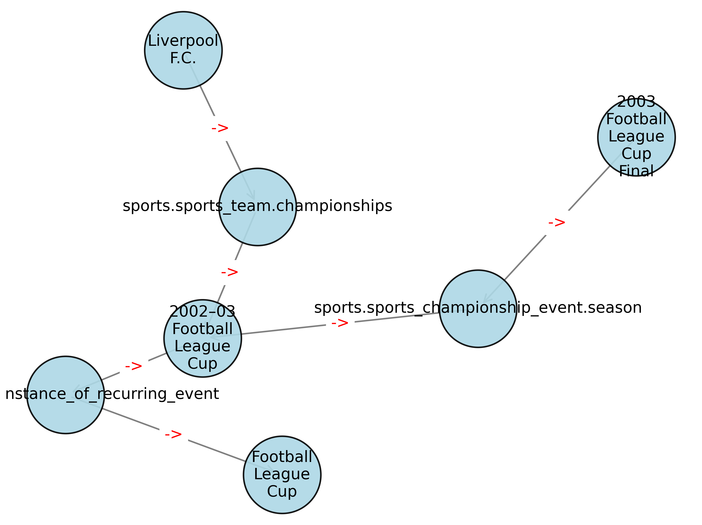
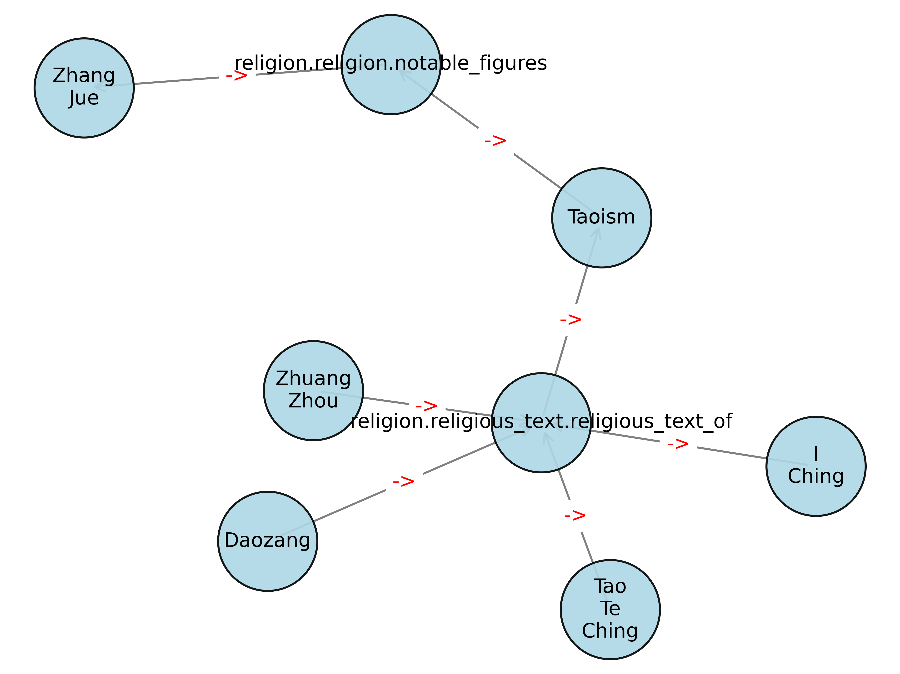
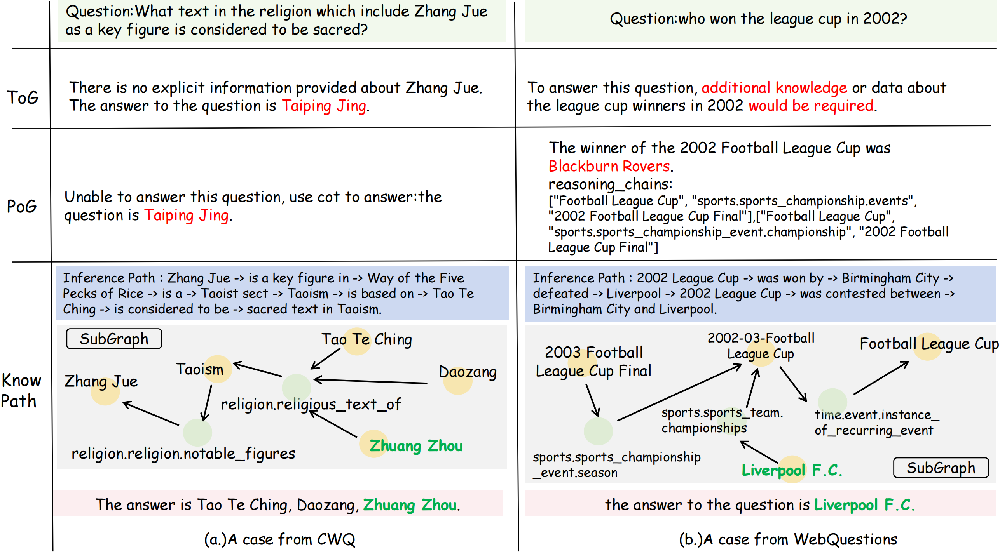

# KnowPath


# About
`KnowPath` is a knowledge-enhanced large language model framework that effectively integrates both internal and external knowledge of LLMs to achieve superior knowledge-based question answering. Its notable advantages include:

- `Reduced LLM invocations` (fewer API calls to LLMs)

- `Lower token consumption` (decreased usage of tokens)

- Capability to generate `fully directed connected knowledge subgraphs`

The framework helps mitigate hallucination phenomena in LLM responses while significantly improving answer interpretability.
# The pipeline of KnowPath



# Project Structure
```
├── CoT
│   ├── cot_io.py                   # COT method run file
│   ├── prompt_list.py              # Prompt of cot method
│   └── utils.py                    # Utility functions
├── data                            # The dataset used in this paper
│   ├── cwq.json
│   ├── README.md                   # See this for details of thest datasets
│   ├── SimpleQA.json
│   ├── WebQSP.json
│   └── WebQuestions.json
├── eval
│   ├── eval.sh                     # Evaluation method script
│   ├── knowpath_eval.py
│   └── utils.py
├── knowpath                        # Source code of KnowPath
│   ├── freebase_func_knowpath.py   # Subgraph Exploration Method
│   ├── knowpath_prompt.py          # Prompt of our proposed KnowPath
│   ├── main.py                     # Entry file
│   ├── reason_path_visualize.py    # Subgraph visualization
│   ├── tempreture.sh               # Analyzing Temperature Hyperparameters
│   └── utils_knowpath.py           # Utility functions of KnowPath
├── README.md
└── requirements.txt                # Pip environment file
```

# Get Start
- ## 1.Deploy FreeBase locally
    Here we would like to acknowledge [ToG](https://github.com/GasolSun36/ToG/tree/main/Freebase) for `providing the FreeBase initialization method`. They have offered a relatively comprehensive installation and startup procedure for FreeBase, so this step can be followed by referring to their provided process.

- ## 2.Install the necessary pip packages
    Run the following command to install the required dependencies:
    ```
    pip install -r requirements.txt
    ```

# How to run KnowPath
```
cd knowpath

python main.py --dataset cwq \ # choose one of the four datasets
               --LLM_type qwen2 \ # you can use local model via ollama or api
               --max_length 512 \ 
               --max_depth 3 \ # Maximum exploration depth, default is 3
               --random_seed 42 \ Random seed, default is 42
               --temperature_reasoning 0 \ Temperature for model inference, default is 0
```
# How to eval
```
cd eval
bash eval.sh
```
# Subgraph visualization
```
cd knowpath
python reason_path_visualize.py 
```
Then you can get:smile::






# Result
<div style="text-align: center">
    
</div>


# Case study
<div style="text-align: center">
    
</div>